
<h1 align="center">学生信息管理系统</h1>

## 简介
学生信息管理系统：系统角色包括管理员、教师和学生；功能模块涵盖课程管理、学生信息管理、成绩管理、资料库管理和选课管理，支持信息录入、查询、修改及多角色操作。    --计算机毕业设计源码；毕设源码；java毕业设计源码

## 联系方式

<h3 align="center">获取完整代码与数据库文件 + 微信：deepguan QQ: 86050149 QQ群: 783742310</h3>

<h3 align="center">可帮忙远程部署 包运行成功！提供远程部署、修改代码、设计文档指导、代码讲解等服务！</h3>

## 功能介绍（完整见运行截图）
管理员：基本功能包括登录、注册和退出。管理员可以在系统中进行学生信息管理、课程管理、公告管理和资料类型管理等操作。资料管理功能允许管理员新增、删除和查询资料，并处理学生选课申请。系统提供搜索功能，便于管理员快速查找信息。管理员可以通过界面查看和编辑资料库内容，以及管理用户及其角色权限。

教师：教师角色可以通过系统进行教学相关操作，包括课程管理、学生信息录入与查询、成绩管理和课程附件下载。教师可查看和管理学生成绩，提供评分和评语。系统支持教师上传和下载与课程相关的教学资料，并通过公告管理模块发布课程相关通知。教师可在个人中心查看和修改个人信息，如联系方式和头像。

用户（学生）：学生用户具备基本功能如注册、登录和退出。通过系统，学生可以注册课程、查看公告和获取个人信息及成绩。学生还可以在个人中心更新信息，如手机号和邮箱，并通过选课管理模块提交、查询选课申请。系统提供界面上传头像及更新个人资料，帮助学生管理个人信息。

普通用户：普通用户具有基本的系统访问功能，支持账号注册和登录。用户可通过系统浏览课程、公告和资料库信息，访问个人中心更新个人信息。系统界面友好，支持查询、查看和下载资料，用户可以根据需要进行相关操作。系统允许用户角色在等级权限之内进行功能访问，较为灵活地管理和利用系统中的资源和信息。

## 运行截图
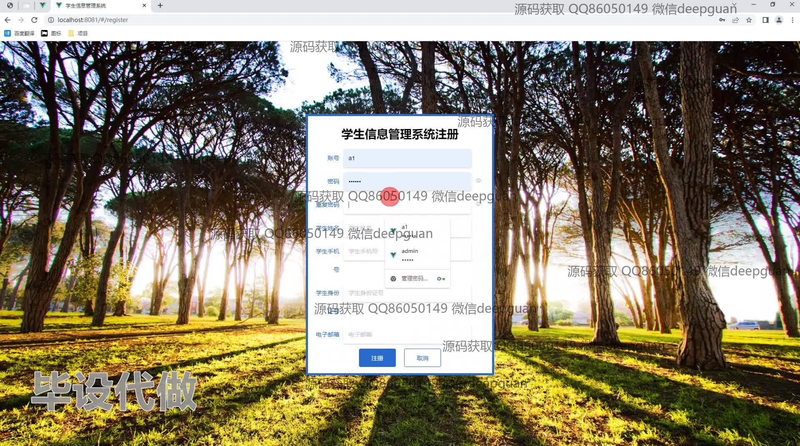
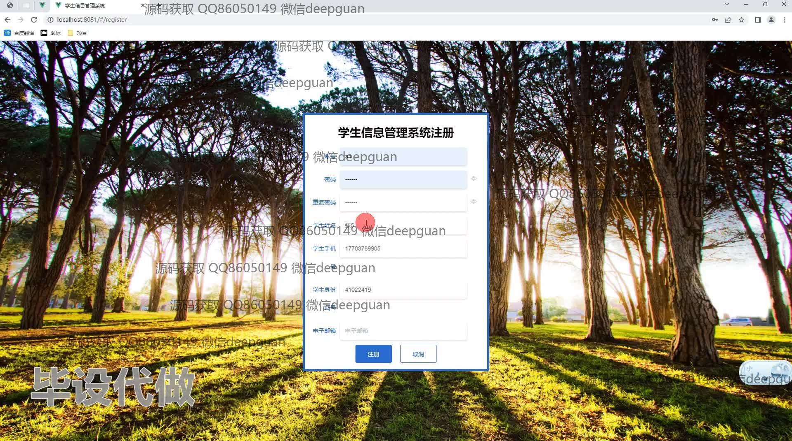
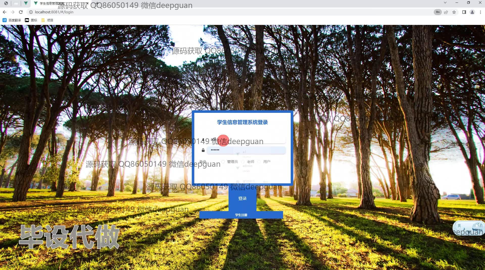
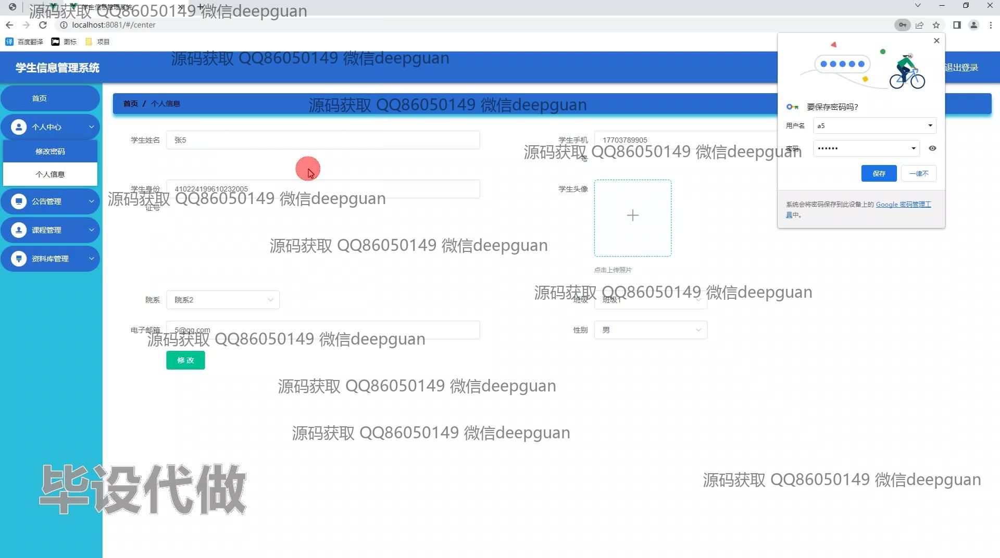
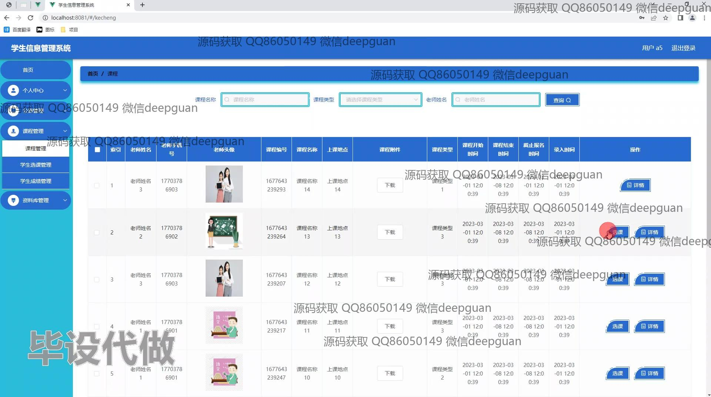
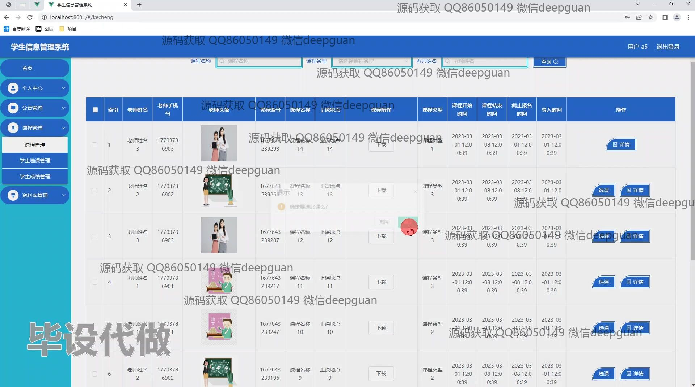
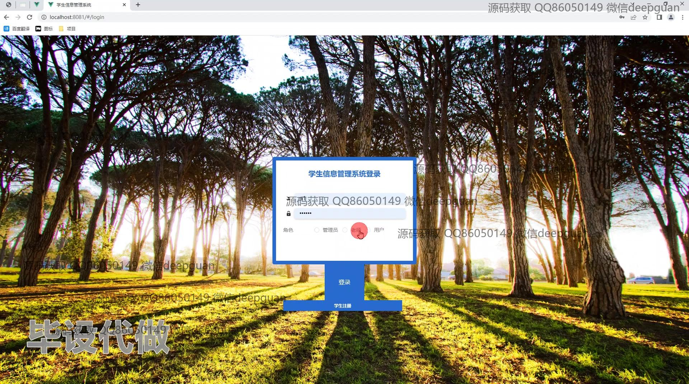
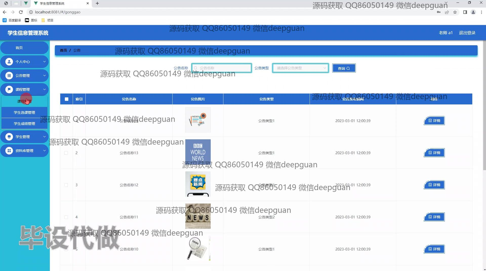
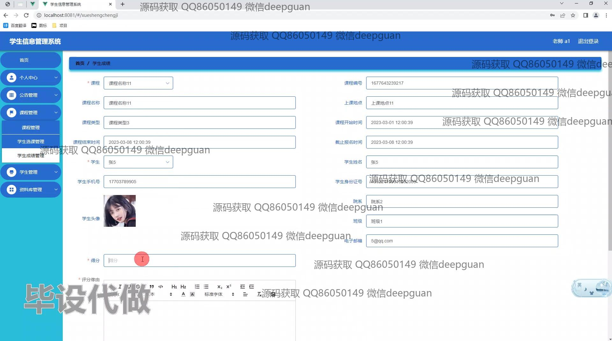
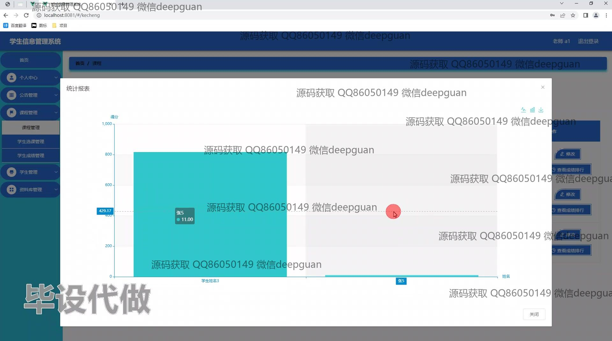
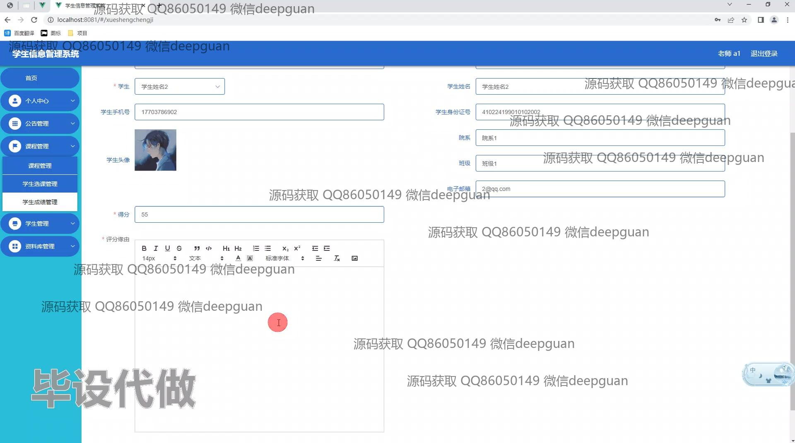
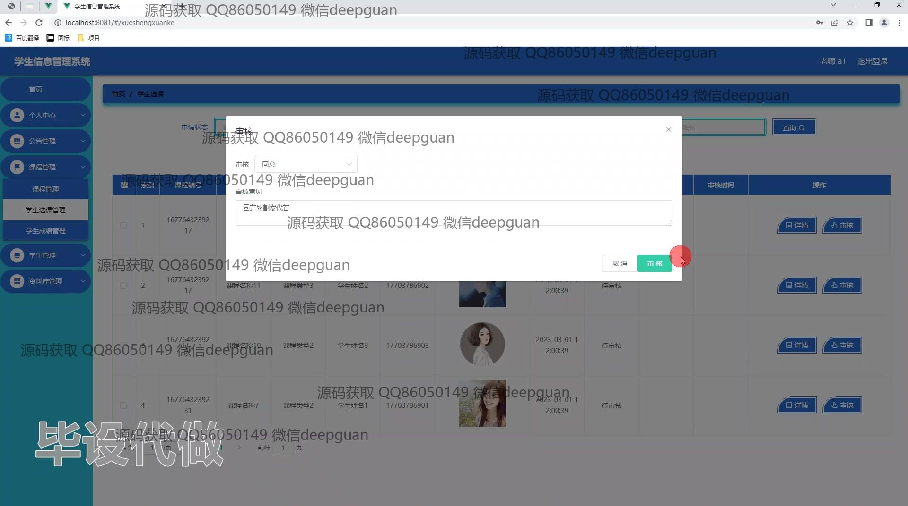
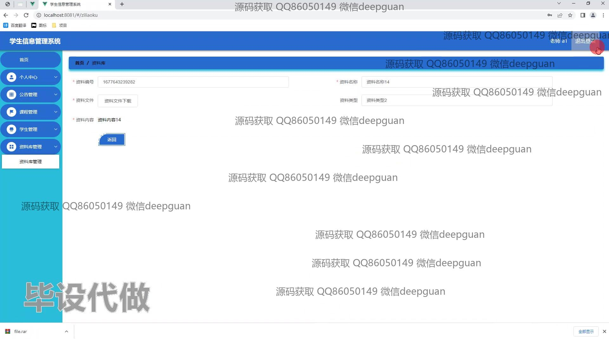
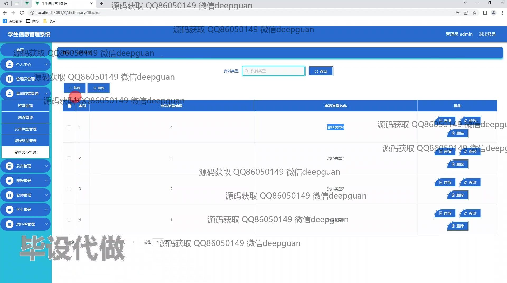
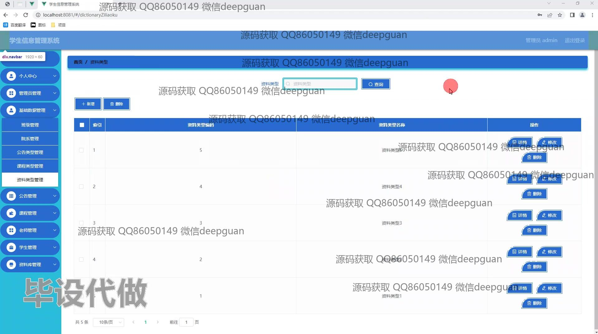
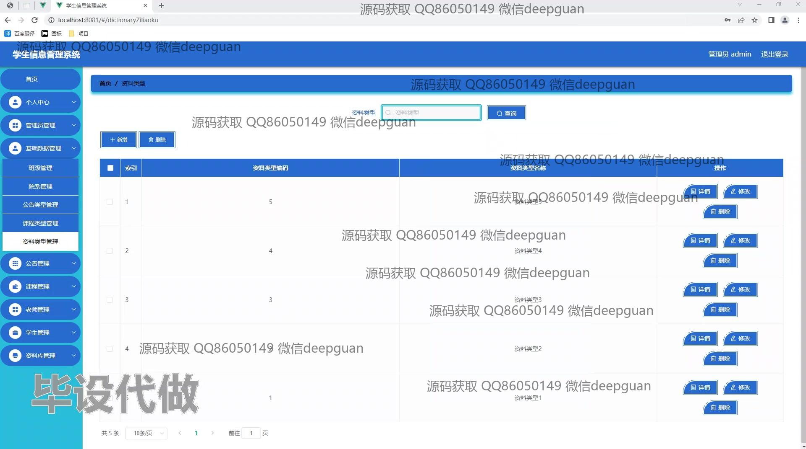
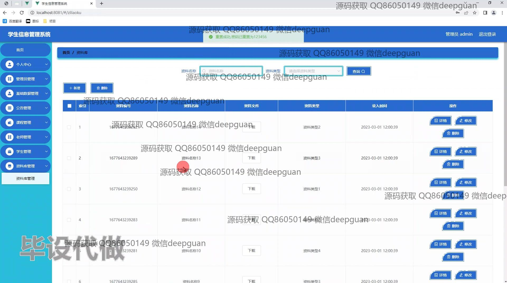

本代码来源于网络,仅供学习参考使用!

